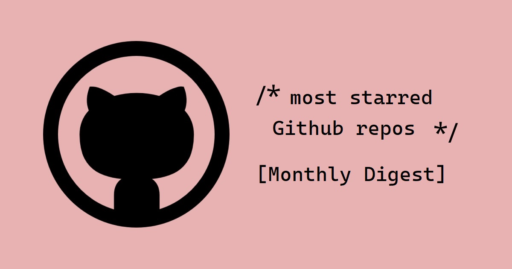

<p align="center"></p>

<h2 align="center">Github Trending Repos</h2>
<h4 align="center"><a href="https://github.com/gemography/frontend-coding-challenge">Gemography Front-end Coding Challenge</a></h4>

---

Working Prototype: https://github-trends.vercel.app/

## Contents

- [Details about the project](#Details-about-the-project)
- [Getting Started](#getting-started)

## Details about the project:

- React library.
- Next.js framework for Incremental Static Regeneration.
- Styled-components.
- Axios to send asynchronous HTTP request to GitHub REST API.
- PWA with next-offline.
- SEO with next-seo.
- Using react-virtualized library to efficiently render a large list.
- Testing:
  - Static Testing with eslint, prop-types and prettier.
  - Unit and Integration Testing with jest and react testing-library.
  - End to End Testing with cypress.

## Getting Started

First, install all dependencies for the project:

```bash
yarn install
```

Second, run the development server:

```bash
yarn dev
```

Open [http://localhost:3000](http://localhost:3000) with your browser to see the
result.

## Learn More

To learn more about Next.js, take a look at the following resources:

- [Next.js Documentation](https://nextjs.org/docs) - learn about Next.js
  features and API.
- [Learn Next.js](https://nextjs.org/learn) - an interactive Next.js tutorial.

You can check out
[the Next.js GitHub repository](https://github.com/vercel/next.js/) - your
feedback and contributions are welcome!

This is a [Next.js](https://nextjs.org/) project bootstrapped with
[`create-next-app`](https://github.com/vercel/next.js/tree/canary/packages/create-next-app).
